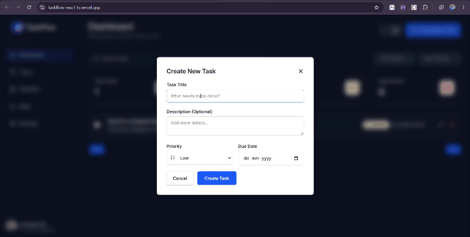
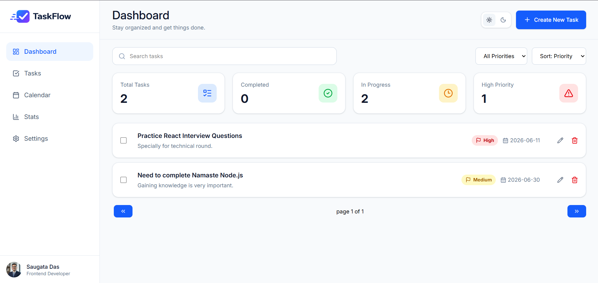
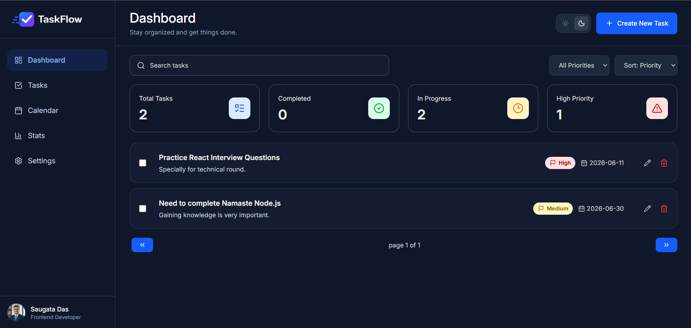

# 🚀 TaskFlow

A modern and responsive task management dashboard built with React, TypeScript, Vite, and Tailwind CSS. TaskFlow helps users organize, prioritize, and track their daily tasks with a clean UI, dark mode support, and local storage persistence.

## 🌐 Live Demo

**Live Application:** https://taskflow-react-ts.vercel.app/

## 📸 Preview

## 🎥 Demo



### Desktop View


### Dark Mode



> Replace the images above with your actual screenshots.

---

## ✨ Features

### Task Management
- Create new tasks
- Edit existing tasks
- Delete tasks
- Mark tasks as completed
- Track task due dates
- Set task priorities (High, Medium, Low)

### Search & Filtering
- Search tasks by title or description
- Filter tasks by priority
- Sort tasks by:
  - Priority
  - Newest Due Date
  - Oldest Due Date

### Dashboard Statistics
- Total Tasks
- Completed Tasks
- In Progress Tasks
- High Priority Tasks

### User Experience
- Responsive design for desktop, tablet, and mobile
- Dark & Light theme support
- Mobile sidebar navigation
- Persistent data using Local Storage
- Modern dashboard UI

---

## 🛠️ Tech Stack

### Frontend
- React
- TypeScript
- Vite
- Tailwind CSS

### UI & Icons
- Lucide React

### Deployment
- Vercel

---

## 📂 Project Structure

```text
src/
├── components/
│   ├── CreateTaskModal.tsx
│   ├── FilterBar.tsx
│   ├── Header.tsx
│   ├── Pagination.tsx
│   ├── SearchBar.tsx
│   ├── Sidebar.tsx
│   ├── TaskItem.tsx
│   ├── TaskList.tsx
│   └── TaskStats.tsx
│
├── types/
│   └── types.ts
│
├── utils/
│   └── utils.ts
│
├── App.tsx
└── main.tsx
```

---

## 🚀 Getting Started

### Clone the Repository

```bash
git clone https://github.com/Saugata15/taskflow-react-ts.git
```

### Navigate to Project

```bash
cd taskflow-react-ts
```

### Install Dependencies

```bash
npm install
```

### Start Development Server

```bash
npm run dev
```

### Build for Production

```bash
npm run build
```

### Preview Production Build

```bash
npm run preview
```

---

## 📱 Responsive Design

TaskFlow is optimized for:

- Desktop
- Tablet
- Mobile Devices

The application includes a mobile-friendly navigation menu and adaptive layouts for smaller screens.

---

## 🌙 Dark Mode

TaskFlow includes a fully functional dark mode with theme persistence using Local Storage.

Features:
- Instant theme switching
- Theme preference saved automatically
- Optimized dark color palette

---

## 💾 Data Persistence

All tasks are stored locally using the browser's Local Storage.

This allows:
- Tasks to persist across page refreshes
- No backend setup required
- Fast and lightweight experience

---

## 🎯 Learning Outcomes

This project helped strengthen skills in:

- React Component Architecture
- TypeScript with React
- State Management
- CRUD Operations
- Local Storage Integration
- Responsive Design
- Dark Mode Implementation
- Tailwind CSS
- Git & GitHub Workflow
- Vercel Deployment

---

## 🔮 Future Improvements

- Drag and Drop Task Reordering
- Task Categories
- Calendar View
- User Authentication
- Backend Integration
- Cloud Database Support
- Task Notifications
- Task Analytics Dashboard

---

## 👨‍💻 Author

**Saugata Das**

GitHub: https://github.com/Saugata15

Project Repository:
https://github.com/Saugata15/taskflow-react-ts

---

## 📄 License

This project is open source and available under the MIT License.